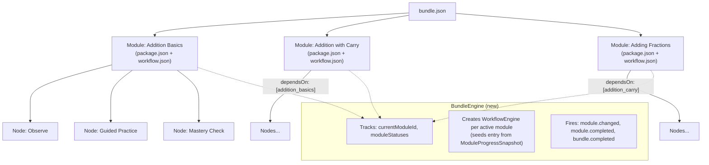

# Architecture Plan: Multi-Module Bundle Support

This proposal outlines the architectural enhancements required for **Open-Edu** to natively support multi-module bundles (inspired by modular curricula structures like `learn-easy/curriculum/level-b/math`).

> **Naming convention.** The existing codebase already uses **"course"** to mean a single Open-Edu package (`CourseRuntime`, `CourseCard`, `CourseOutline`, `CourseTree`, `TopAppBar.isCourseView`, E2E selectors like `course-runtime`). To avoid overloading that term, this plan introduces a distinct term — **"bundle"** — for the multi-module aggregate. A **bundle** is a collection of **modules**, where each module **is** a standard Open-Edu package. All new symbols use the `Bundle*` prefix (`BundleManifest`, `BundleEngine`, `BundleOverview`, `LoadedBundle`, `bundle.json`, …). The existing single-package "course" UI is left untouched.

---

## 1. Problem Statement & Goals

Currently, Open-Edu treats each learning package (`package.json`) as a flat, single-workflow entity containing nodes (`nodes/*.md` or `.json`). However, rich educational curricula are structured hierarchically:

- **Bundle / Subject** (e.g., _Level B Math_)
  - **Modules / Chapters** (e.g., _Addition Basics_, _Adding Fractions_)
    - **Activities / Nodes** (e.g., _Observe_, _Guided Practice_, _Mastery Check_)

### Goals:

1. **Bundle Packaging Format**: Define how multi-module bundles are defined, validated, and bundled — where each module **is** an existing Open-Edu package.
2. **Schema & Core Enhancements**: Add `BundleManifestSchema`, `BundleProgressSnapshotSchema`, `loadBundle`, `scanBundles`, and `scanAll` — all additive, no breaking changes.
3. **BundleEngine**: New workflow-level orchestrator that manages module lifecycle without modifying `WorkflowEngine`.
4. **Learner App Experience**: Syllabus navigation with module lock/unlock, breadcrumbs, and bundle-level progress.
5. **Dev-Server Integration**: Module selector dropdown, bundle inspector panel.
6. **Learn-Easy Importer**: CLI adapter to convert Learn-Easy directory structures into Open-Edu bundle + module packages.
7. **Backward Compatibility**: All existing single-package courses continue to work unchanged.

---

## 2. Data Model

The core insight: a **bundle** is a collection of packages. Each module **is** an Open-Edu package with its own `package.json`, `workflow.json`, `nodes/`, `rewards.json`, and `assets/`.

```
bundle/
├── bundle.json               # Bundle manifest (NEW)
├── modules/
│   ├── addition_basics/      # Standard Open-Edu package (module)
│   │   ├── package.json
│   │   ├── workflow.json
│   │   ├── nodes/
│   │   └── rewards.json
│   ├── addition_carry/       # Standard Open-Edu package (module)
│   │   ├── package.json
│   │   └── ...
│   └── adding_fractions/     # Standard Open-Edu package (module)
│       ├── package.json
│       └── ...
```

This means:

- **No new module-level schema** — `PackageManifestSchema` is reused
- **No changes to `loadPackage`** — it loads individual modules as-is
- **No changes to `WorkflowEngine`** — each module gets its own instance
- **Preexisting single-package courses require no migration** — they simply lack a `bundle.json`

### Module identity contract

Each `BundleModuleRef` declares an `id` (the module identifier within the bundle, e.g. `"addition_basics"`). **This `id` MUST equal the module package's own `package.json` `id`** (`LoadedPackage.manifest.id`). `loadBundle` validates this on load and throws `ModuleMismatchError` if the two differ. This guarantees that bundle-level lookups, telemetry correlation, and progress keys all resolve to a single canonical id. Authors must set both to the same kebab-case value.

### Resume & checkpoint boundary

`WorkflowEngine` is stateless across `stop()`/`start()` (it clears listeners and derives current-node from a fresh XState actor). `BundleEngine` therefore owns persistence responsibility:

- Before `switchModule` or `stop()`, `BundleEngine` snapshots the active module's state to a `ModuleProgressSnapshot` (current node, visited nodes, scores, completion).
- On `start(moduleId)` / `switchModule(moduleId)`, it loads the persisted snapshot for that module (if any) and passes `entry: snapshot.currentNodeId` (falling back to the workflow's first routing key) into `WorkflowEngineOptions`. Per-node scores are restored into the persisted `ModuleProgressSnapshot` for display; skill scores are re-seeded via `createSkillState` + `applyAssessment` replay when a `skillGraph` is present (the engine already supports this). Node-visited history is restored from the snapshot, not from the engine (the engine does not track visited nodes).
- `WorkflowEngine` itself is **not modified** — all reconstruction is orchestrated by `BundleEngine` + the app's persistence layer.



---

## 3. Component Plan

### A. Schema Additions (`packages/schemas`)

#### [NEW] `packages/schemas/src/bundle.ts`

```typescript
import { z } from 'zod';

export const BundleModuleRefSchema = z.object({
  id: z
    .string()
    .min(1)
    .max(128)
    .regex(/^[a-z0-9][a-z0-9_-]*$/, 'module id must be kebab-case'),
  title: z.string().min(1).max(256),
  chapterCode: z.string().optional(), // e.g. "CH2"
  path: z.string().min(1).max(512), // relative path to module directory, e.g. "./modules/addition_basics"
  dependsOn: z.array(z.string()).default([]), // module IDs that must be completed first
  estimatedDuration: z.number().positive().optional(), // minutes
});

export const BundleManifestSchema = z.object({
  id: z
    .string()
    .min(1)
    .max(128)
    .regex(/^[a-z0-9][a-z0-9_-]*$/, 'id must be kebab-case (lowercase, hyphens, underscores)'),
  type: z.literal('bundle').default('bundle'),
  title: z.string().min(1).max(256),
  level: z.string().optional(), // e.g. "level-b" — free-text filter facet (see §3A notes)
  subject: z.string().optional(), // e.g. "math"  — free-text filter facet (see §3A notes)
  description: z.string().optional(),
  version: z
    .string()
    .min(1)
    .max(64)
    .regex(/^\d+\.\d+\.\d+$/, 'version must be semver format (e.g. 1.0.0)'),
  author: z.string().min(1).max(128),
  modules: z.array(BundleModuleRefSchema).min(1),
  skills: z.array(z.string()).optional(), // bundle-level skill references
  rewards: z.string().optional(), // relative path to an optional bundle-level rewards.json (see §3B rewards)
});

export type BundleManifest = z.infer<typeof BundleManifestSchema>;
export type BundleModuleRef = z.infer<typeof BundleModuleRefSchema>;
```

> **`level` / `subject` are free-text filter facets**, not closed enums. They are intended for catalog filtering/navigation (e.g., a "Math" filter chip). Applications treat unknown values as opaque tags; there is no validation against a fixed vocabulary in v1. A future epic may introduce a registered vocabulary if curation needs arise.

**Structural validation split (avoid duplicated/divergent logic):**

- **Schema-level (`BundleManifestSchema` via `.superRefine`)**: verifies that all module `id`s are unique within the array (cheap, local check).
- **Loader-level (`loadBundle`)**: verifies `dependsOn` references resolve to valid module `id`s (no dangling prereqs), and detects cycles via topological sort — graph algorithms are idiomatic here, not in a Zod superRefine.

#### [MODIFY] `packages/schemas/src/progress.ts`

Add `BundleProgressSnapshotSchema` alongside the existing `ProgressSnapshotSchema` (the existing per-package schema is reused as each module's node-level progress):

```typescript
export const ModuleProgressSnapshotSchema = z.object({
  moduleId: z.string(),
  packageVersion: z.string().min(1).max(64), // the module package's version
  currentNodeId: z.string(),
  visitedNodes: z.array(z.string()),
  scores: z.record(z.number()).default({}),
  isCompleted: z.boolean().default(false),
  completedAt: z.string().optional(),
});

export const BundleProgressSnapshotSchema = z.object({
  bundleId: z.string(),
  bundleVersion: z.string().min(1).max(64),
  currentModuleId: z.string().optional(),
  moduleStatuses: z.record(z.enum(['locked', 'unlocked', 'in_progress', 'completed'])).default({}),
  moduleProgress: z.record(ModuleProgressSnapshotSchema).default({}),
  updatedAt: z.string().datetime(),
});
```

> `ModuleProgressSnapshot` intentionally mirrors the existing `ProgressSnapshotSchema` shape (currentNode/visitedNodes/scores/isCompleted) but keys it by `moduleId` within the bundle and tracks per-module completion timestamp. Apps that already read `ProgressSnapshot` for a single package can reuse the same UI logic at the module level.

#### [MODIFY] `packages/schemas/src/telemetry.ts` (bundle correlation)

Telemetry events currently carry only `timestamp` + optional `sessionId` (no package/module/bundle correlation). To enable the dev-server "module-level telemetry summary" and bundle-level aggregation, extend the **base** event fields with optional correlation ids (additive, gated by optionality):

```typescript
// Extend the shared base applied to every event variant:
export const TelemetryEventBaseSchema = z.object({
  timestamp: z.number(),
  sessionId: z.string().optional(),
  bundleId: z.string().optional(), // NEW — set by BundleEngine when present
  moduleId: z.string().optional(), // NEW — set by BundleEngine when present
});
```

`BundleEngine` injects `bundleId`/`moduleId` into every telemetry event it forwards (see §3C). Single-package apps continue to omit these fields (they remain optional), so existing telemetry JSONL files stay valid.

#### [MODIFY] `packages/schemas/src/rewards.ts` (bundle/module completion conditions)

`RewardConditionSchema` currently supports `score` (per node), `skill`, `chain` (completed node ids), `and`/`or`. There is **no module- or bundle-completion condition**. To support bundle-wide badges (e.g. "Complete all 6 modules"), extend the discriminated union:

```typescript
export const RewardConditionSchema = z.discriminatedUnion('kind', [
  // ...existing: score, skill, chain, and, or...
  z.object({
    kind: z.literal('moduleCompleted'),
    moduleId: z.string().min(1).max(128),
  }),
  z.object({
    kind: z.literal('bundleCompleted'),
  }),
]);
```

And extend `ContextSnapshot` (in `packages/rewards/src/types.ts`) with `completedModules: string[]` (default `[]`). `BundleEngine` updates the broker context whenever a module completes. This makes a bundle-level `rewards.json` (referenced by `BundleManifestSchema.rewards`) actionable. The existing per-module `rewards.json` continues to work unchanged.

#### [MODIFY] `packages/schemas/src/index.ts`

Add these exports alongside existing ones:

```typescript
export { BundleManifestSchema, BundleModuleRefSchema } from './bundle.js';
export type { BundleManifest, BundleModuleRef } from './bundle.js';
export { BundleProgressSnapshotSchema, ModuleProgressSnapshotSchema } from './progress.js';
export type { BundleProgressSnapshot, ModuleProgressSnapshot } from './progress.js';
```

---

### B. Core Package Additions (`packages/core`)

All additions are **new files and exports**. No existing function is modified.

#### [NEW] `packages/core/src/bundle-loader.ts`

New async function to load a bundle and all its modules:

```typescript
export interface LoadedBundle {
  rootDir: string;
  manifest: BundleManifest;
  modules: LoadedPackage[];
  moduleMap: Map<string, LoadedPackage>; // keyed by module id
}

export async function loadBundle(bundleDir: string): Promise<LoadedBundle>;
```

**Behavior:**

1. Read and validate `bundle.json` from `bundleDir` using `BundleManifestSchema` (schema also enforces unique module ids).
2. For each module in `manifest.modules`:
   - Resolve `path` relative to `bundleDir`
   - Call `loadPackage(resolvedPath)` — reuses existing module loader
   - **Validate the module identity contract**: `moduleRef.id === loadedPackage.manifest.id`; throw `ModuleMismatchError` otherwise.
3. Validate prerequisite graph in the loader (not the schema): dangling `dependsOn` → `MissingPrerequisiteError`; cycle → `CircularDependencyError`.
4. Build `moduleMap` for O(1) lookups
5. Return `LoadedBundle`

**Errors** (new exports from `packages/core/src/errors.ts`; extend the existing `PackageLoadError` base class):

- `BundleValidationError` — invalid `bundle.json`, missing/invalid fields (carries `zodError`)
- `ModuleNotFoundError` — module path doesn't exist or has no valid `package.json`
- `ModuleMismatchError` — `BundleModuleRef.id` ≠ `loadedPackage.manifest.id`
- `CircularDependencyError` — cycle in `dependsOn`
- `MissingPrerequisiteError` — `dependsOn` references unknown module id

#### [NEW] `packages/core/src/bundle-scanner.ts`

New **synchronous** function to scan for bundles alongside existing package scanning. This mirrors `scanPackages`, which is itself synchronous and reads files synchronously — keeping both synchronous lets `scanAll` stay synchronous and avoids an inconsistent sync/async mix.

```typescript
export interface BundleSummary {
  manifest: BundleManifest;
  moduleCount: number;
  totalNodeCount: number;
  rootDir: string;
  moduleSummaries: PackageSummary[];
}

export function scanBundles(dir: string): BundleSummary[];
export function scanAll(dir: string): {
  packages: PackageSummary[];
  bundles: BundleSummary[];
};
```

**Behavior:**

- `scanBundles`: iterates subdirectories looking for `bundle.json`, validates with `BundleManifestSchema`, and counts total nodes across all modules by calling `scanPackages` (sync) on each resolved module path. Invalid bundles are silently skipped (matching `scanPackages` behavior).
- `scanAll`: runs both `scanPackages` and `scanBundles` (both sync) and returns them combined. This is the new recommended entry point for apps (learner, dev-server).

> `loadBundle` remains **async** (it calls `loadPackage`, which is async). Scanning is sync, loading is async — consistent with the existing `scanPackages` (sync) / `loadPackage` (async) split.

#### [MODIFY] `packages/core/src/types.ts`

Add new types:

```typescript
export interface LoadedBundle {
  rootDir: string;
  manifest: BundleManifest;
  modules: LoadedPackage[]; // all modules, in manifest order
  moduleMap: Map<string, LoadedPackage>;
}
```

#### [MODIFY] `packages/core/src/index.ts`

Add new exports:

```typescript
export { loadBundle } from './bundle-loader.js';
export type { LoadedBundle } from './types.js';
export { scanBundles, scanAll } from './bundle-scanner.js';
export type { BundleSummary } from './bundle-scanner.js';
export {
  BundleValidationError,
  ModuleNotFoundError,
  ModuleMismatchError,
  CircularDependencyError,
  MissingPrerequisiteError,
} from './errors.js';
```

> **Note: bundle-level build & integrity (out of scope for v1).** The existing `computeFileHash`/`verifyIntegrity`/`BuildManifest` and the `edu build`/`edu package` commands are per-package. A bundle-level integrity manifest-of-hashes and a single-command multi-module build are deferred to a follow-up epic. v1 ships per-module builds; the bundle is a thin coordinator over already-built modules.

---

### C. BundleEngine (`packages/workflow`)

#### [NEW] `packages/workflow/src/bundle-engine.ts`

A new class that orchestrates module-level workflow engines. **Does not modify `WorkflowEngine`.**

```typescript
export type ModuleStatus = 'locked' | 'unlocked' | 'in_progress' | 'completed';

export interface BundleEngineOptions {
  entry?: string; // initial module ID; defaults to first unlocked module
  // Persisted snapshots keyed by moduleId, used to seed resume/checkpoint:
  moduleSnapshots?: Record<string, ModuleProgressSnapshot>;
  skillGraph?: SkillGraph; // optional bundle-level skill graph
}

export interface ModuleChangeEvent {
  type: 'module.changed';
  previousModuleId: string | null;
  currentModuleId: string;
}

export interface ModuleCompletedEvent {
  type: 'module.completed';
  moduleId: string;
}

export interface BundleCompletedEvent {
  type: 'bundle.completed';
}

export interface ModuleUnlockedEvent {
  type: 'module.unlocked';
  moduleId: string;
}

export type BundleEngineEvent =
  | ModuleChangeEvent
  | ModuleCompletedEvent
  | BundleCompletedEvent
  | ModuleUnlockedEvent;

export class BundleEngine {
  private loadedBundle: LoadedBundle;
  private engineMap: Map<string, WorkflowEngine>;
  private currentModuleId: string | null;
  private moduleStatuses: Record<string, ModuleStatus>;
  private listeners: BundleEngineEventListener[];
  private moduleSubscriptions: Map<string, () => void>;
  private moduleSnapshots: Record<string, ModuleProgressSnapshot>;
  private skillGraph?: SkillGraph;
  private telemetryTag?: (event: TelemetryEvent) => TelemetryEvent; // injects bundleId/moduleId

  constructor(loadedBundle: LoadedBundle, options?: BundleEngineOptions);

  start(moduleId?: string): void;
  stop(): void;

  getCurrentModuleId(): string | null;
  getCurrentEngine(): WorkflowEngine | null;
  getModuleStatus(moduleId: string): ModuleStatus;
  getModuleStatuses(): Record<string, ModuleStatus>;
  getModuleSnapshot(moduleId: string): ModuleProgressSnapshot | null;
  isCompleted(): boolean;

  switchModule(moduleId: string): void;
  subscribe(listener: BundleEngineEventListener): () => void;

  /** Tag forwarded telemetry events with bundleId/moduleId (see §3A telemetry). */
  attachTelemetry(session: TelemetrySession): void;

  /** Internal: evaluates prerequisites, unlocks newly available modules */
  private evaluatePrerequisites(completedModuleId: string): void;
  /** Internal: snapshot active module before switch/stop (resume/checkpoint) */
  private snapshotActiveModule(): void;
}
```

**Behavior:**

1. **`start(moduleId?)`**: lazily creates a `WorkflowEngine` for the active module. Determines the initial module (first unlocked or specified entry). Before starting, if a persisted `ModuleProgressSnapshot` exists for that module, seeds `WorkflowEngineOptions.entry` with `snapshot.currentNodeId` (falling back to the workflow's first routing key). Calls `engine.start()` on the active module's engine. Subscribes internally to the engine's events.
2. **`switchModule(moduleId)`**: snapshots the active module's state (`snapshotActiveModule`), stops the current engine, starts the target module's engine (seeded from its snapshot if present), fires `module.changed`.
3. **`stop()`**: snapshots the active module, stops the active engine, clears subscriptions.
4. **Prerequisite evaluation** (`evaluatePrerequisites`): when a module's `workflow.completed` event fires, marks the module `completed`, updates `moduleStatuses` + snapshots, evaluates all modules whose `dependsOn` is now fully satisfied, marks them `unlocked`, fires `module.unlocked`. If all modules are completed, fires `bundle.completed`.
5. **Telemetry correlation** (`attachTelemetry`): when the app wires a `TelemetrySession`, `BundleEngine` subscribes and re-emits events with `bundleId`/`moduleId` injected (per §3A telemetry schema). This enables the dev-server module-level telemetry summary without changes to the telemetry package itself.
6. **Resume boundary**: per-node scores and visited-node history live in `ModuleProgressSnapshot` (persisted by the app), restored into the snapshot store on `start`/`switchModule`. Skill scores are re-seeded via `createSkillState` + `applyAssessment` replay when a `skillGraph` is passed; the `WorkflowEngine` is not modified.

#### [NEW] `packages/workflow/src/bundle-engine.test.ts`

Tests (at minimum):

- `constructor` accepts `LoadedBundle` and validates module IDs
- `start` creates `WorkflowEngine` for first unlocked module, seeded from a persisted snapshot's `currentNodeId`
- `switchModule` snapshots the previous module, changes active module, fires `module.changed`
- `evaluatePrerequisites` unlocks dependent modules after completion
- `isCompleted` returns true only after all modules are done
- Events are properly emitted and received by subscribers
- Module with `dependsOn: ['nonexistent']` throws at construction (`MissingPrerequisiteError`)
- Module whose `moduleRef.id` ≠ `manifest.id` throws at load (`ModuleMismatchError`) — verified in `bundle-loader.test.ts`
- `stop`/`switchModule` round-trips preserve current node across a stop→start with a snapshot

#### [MODIFY] `packages/workflow/src/index.ts`

Add exports:

```typescript
export { BundleEngine } from './bundle-engine.js';
export type {
  BundleEngineOptions,
  BundleEngineEvent,
  ModuleStatus,
  ModuleChangeEvent,
  ModuleCompletedEvent,
  BundleCompletedEvent,
  ModuleUnlockedEvent,
} from './bundle-engine.js';
```

---

### D. Runtime Additions (`packages/runtime`)

The `CourseTree` component already exists at `packages/runtime/src/layout/CourseTree.tsx` and accepts `CourseTreeModule[]` with `title`, `lessons`, `isLocked`. Its shape (`title` + `lessons` + `isLocked`) maps to a **per-module lesson list**, not to a whole-bundle syllabus overview.

#### [NEW] `packages/runtime/src/components/BundleOverview.tsx`

A **standalone** component for the bundle syllabus page (it does not wrap `CourseTree`, because `BundleOverviewModule` carries `status`/`nodeCount`/`completedNodeCount`/`estimatedDuration`, which `CourseTreeModule` lacks). `CourseTree` remains available for the optional in-module step list within `CourseRuntime`.

```typescript
export interface BundleOverviewModule {
  id: string;
  title: string;
  chapterCode?: string;
  status: ModuleStatus; // 'locked' | 'unlocked' | 'in_progress' | 'completed'
  nodeCount: number;
  completedNodeCount: number;
  estimatedDuration?: number; // minutes
  prerequisiteLabel?: string; // e.g. "Complete Addition Basics first"
}

export interface BundleOverviewProps {
  bundleTitle: string;
  bundleId: string;
  description?: string;
  modules: BundleOverviewModule[];
  onStartModule: (moduleId: string) => void;
  onContinueModule?: (moduleId: string) => void; // for the in-progress module
  onBackToCatalog: () => void;
}

export function BundleOverview(props: BundleOverviewProps): JSX.Element;
```

**Behavior:**

- Shows bundle title, description, overall progress bar
- Accordion/list of modules (own styles, referencing `--oe-*` CSS vars like the rest of the runtime)
- Each module shows: title, chapter code, status badge (locked/in-progress/completed), node progress bar, estimated duration
- Clicking an unlocked/in-progress module calls `onStartModule`/`onContinueModule`
- Locked modules show a lock icon and their `prerequisiteLabel`
- "Continue" button on the in-progress module

#### [MODIFY] `packages/runtime/src/index.ts`

Add:

```typescript
export { BundleOverview } from './components/BundleOverview.js';
export type { BundleOverviewProps, BundleOverviewModule } from './components/BundleOverview.js';
```

---

### E. Learner App (`apps/learner`)

#### [MODIFY] `apps/learner/src/LeftNav.tsx` — `AppView` union type

Two view variants change: add a `bundleOverview` variant, and extend the existing `course` variant with optional bundle context. (As written in the original plan this was internally inconsistent; corrected here.)

```typescript
export type AppView =
  | { view: 'home' }
  | { view: 'catalog' }
  | { view: 'progress' }
  | { view: 'settings' }
  | { view: 'course'; packageId: string; bundleId?: string; moduleId?: string } // extended
  | { view: 'bundleOverview'; bundleId: string }; // NEW
```

> When `bundleId`/`moduleId` are present on the `course` view, `CourseRuntime` operates in multi-module mode via a `bundleContext` prop (see below). When absent, behavior is identical to today (single-package course).

#### [MODIFY] `apps/learner/src/AppShell.tsx`

- Accept `bundleEntries: Record<string, LoadedBundle>` alongside the existing `packageEntries`.
- Handle `view: 'bundleOverview'` routing — renders `BundleOverviewPage`.
- Handle `view: 'course'` with bundle context present — renders `CourseRuntime` with `bundleContext`.
- Breadcrumbs: bundle overview > module title (when in multi-module mode).
- **Exit-warning semantics** (see `CourseExitWarningDialog`):
  - Navigating from a module **back to the bundle overview** (same `bundleId`) does **not** show the exit-warning dialog — it is internal navigation within the bundle.
  - Navigating away from the bundle entirely (to catalog/home/progress/settings, or to a _different_ bundle/package mid-module) shows the dialog, with copy that references the **bundle** title in multi-module mode and the package title in single-package mode.

#### [NEW] `apps/learner/src/BundleOverviewPage.tsx`

```typescript
export interface BundleOverviewPageProps {
  bundle: LoadedBundle;
  bundleProgress: BundleProgressSnapshot | null;
  onStartModule: (bundleId: string, moduleId: string) => void;
  onBackToCatalog: () => void;
}

export function BundleOverviewPage(props: BundleOverviewPageProps): JSX.Element;
```

**Behavior:**

- Loads bundle progress from `bundleProgressStorage.ts` (`getBundleProgress`)
- Computes `BundleOverviewModule[]` from `LoadedBundle.modules` + progress data (deriving `prerequisiteLabel` from each module's `dependsOn` + module titles)
- Renders `<BundleOverview>` from runtime
- "Start Module" navigates to `{ view: 'course', packageId: moduleId, bundleId, moduleId }`

#### [MODIFY] `apps/learner/src/CourseRuntime.tsx`

**Extend to support multi-module context:**

```typescript
export interface CourseRuntimeProps {
  pkg: LoadedPackage;
  bundleContext?: {
    bundleId: string;
    moduleId: string;
    bundleTitle: string;
    onSwitchModule: (moduleId: string) => void;
    onBackToSyllabus: () => void;
  };
  onBackToCatalog: () => void;
  // ...existing props
}
```

**Changes:**

- When `bundleContext` is provided, show breadcrumb (`bundleTitle` > "Back to Syllabus") and current module name in the `TopAppBar`/header, and run the active module within a `BundleEngine`.
- Module completion → offer `onSwitchModule` to the next unlocked module, or `onBackToSyllabus`. `BundleEngine` handles snapshot/restore of module progress across switches.
- Otherwise, behavior is identical to current single-package mode.

#### [NEW] `apps/learner/src/bundleProgressStorage.ts`

Analogous to `progressStorage.ts` but for bundle-level data (mirrors its localStorage pattern; `progressStorage.ts` is left unchanged):

```typescript
const STORAGE_KEY = 'open-edu-bundle-progress';

export interface BundleProgressData {
  [bundleId: string]: BundleProgressSnapshot;
}

export function getAllBundleProgress(): BundleProgressData;
export function getBundleProgress(bundleId: string): BundleProgressSnapshot | null;
export function saveBundleProgress(bundleId: string, snapshot: BundleProgressSnapshot): void;
```

> Per-module node-level progress continues to be persisted by the existing `progressStorage.ts`, keyed by the module's `packageId` (which, per the identity contract, equals the module's bundle id). This keeps `progressStorage.ts` untouched and lets a module also be launched standalone as a single-package course.

#### [MODIFY] `apps/learner/src/CatalogPage.tsx`

**Add bundle-aware display:**

- Accept `bundleSummaries: BundleSummary[]` as a new prop
- Show bundle cards alongside package cards (distinguishable by badge or layout)
- Bundle cards show: module count (`6 modules`), total node count, overall progress (from `bundleProgressStorage`)
- Clicking a bundle navigates to `{ view: 'bundleOverview', bundleId }`
- Filter chips and sorting apply to both packages and bundles
- "Continue Learning" shelf shows in-progress bundles alongside in-progress packages

#### [MODIFY] Virtual module (`virtual:edu-data`) — implemented in `apps/learner/vite.config.ts`

> The original plan referenced `main.tsx`, but the virtual module is actually wired in **`apps/learner/vite.config.ts`** (`eduDataPlugin`) and consumed in **`apps/learner/src/App.tsx`**. That is where the change lands.

The `eduDataPlugin` currently calls `scanPackages(CATALOG_DIR)` and `loadPackage()` for each summary, exporting `catalogPackages` + `packageEntries`. Extend it to:

- Call `scanAll(CATALOG_DIR)` (returns both packages and bundles) instead of `scanPackages` alone.
- Export `catalogBundles: BundleSummary[]` and `bundleEntries: Record<string, LoadedBundle>` (built by calling `loadBundle()` for each bundle summary).
- `apps/learner/src/env.d.ts` declares the extended `virtual:edu-data` module types.
- `apps/learner/src/App.tsx` imports `catalogBundles`/`bundleEntries` and passes them to `<AppShell>` alongside the existing props.

#### [MODIFY] `apps/learner/src/HomePage.tsx`

Update dashboard stats to include bundle counts:

- Total learning units (bundles + packages)
- Bundles in progress
- Overall badge count across all bundles and packages

---

### F. Dev-Server (`apps/dev-server`)

> The original plan's env/virtual-module wiring was underspecified. The dev-server loads its package via the `eduPackageLoader()` plugin in **`apps/dev-server/vite.config.ts`**, which reads `process.env.OPEN_EDU_PACKAGE_DIR` and calls `loadPackage()`. The course-aware mode requires changes there, not solely in `DevApp.tsx`.

#### [MODIFY] `apps/dev-server/vite.config.ts` (`eduPackageLoader`)

- Detect whether `OPEN_EDU_PACKAGE_DIR` contains a `bundle.json` (multi-module) or a `package.json` (single-module).
- For **multi-module bundles**: introduce a second env var `OPEN_EDU_BUNDLE_DIR` (preferred) or auto-detect `bundle.json`; call `loadBundle()` instead of `loadPackage()`, and export `bundleData: LoadedBundle | null` (in addition to/instead of `packageData`). On file change, hot-reload via `loadBundle`.
- For **single-module packages**: behavior is identical to today.
- Update `apps/dev-server/src/env.d.ts` to declare the `virtual:open-edu-bundle` module type when present.

#### [MODIFY] `apps/dev-server/src/DevApp.tsx`

**Add bundle-aware mode:**

- Import `bundleData` from the virtual module.
- For multi-module bundles:
  - Load `LoadedBundle` via the virtual module instead of a single `LoadedPackage`.
  - Render a module selector dropdown at the top.
  - When a module is selected, wire `RuntimeProvider` with the selected module's `LoadedPackage` (looked up via `bundle.moduleMap`).
  - Show "Back to Bundle Overview" breadcrumb.
- For single-module packages: behavior is identical to current.

#### [NEW] `apps/dev-server/src/inspectors/BundleInspector.tsx`

New inspector tab (4th tab alongside Telemetry, Rewards, A11y):

- Module dependency graph visualization (simple DAG)
- Per-module status: locked/unlocked/in-progress/completed
- Module-level telemetry summary (driven by the `bundleId`/`moduleId` correlation fields added in §3A)
- Jump-to-module controls

#### [MODIFY] `apps/dev-server/src/inspectors/InspectorPanel.tsx`

Add a 4th `bundle` tab to the existing `Tab` union (`'telemetry' | 'accessibility' | 'rewards'` → add `'bundle'`), rendered only when in multi-module mode.

---

### G. Learn-Easy Importer (`packages/core`)

> **Precondition (must validate before implementation).** The mapping table below assumes a Learn-Easy directory structure based on the description in this proposal. **Before writing this importer, the implementer must validate the real Learn-Easy schema** (field names, nesting, whether each module is a `.json` file or a directory). If the real structure differs materially, this step should be split into its own follow-up PR with a fixture captured from a real Learn-Easy curriculum. The importer is the least-grounded section of this plan.

#### [NEW] `packages/core/src/learn-easy-importer.ts`

```typescript
export interface ImportOptions {
  sourceDir: string;
  outputDir: string;
  bundleTitle?: string;
  bundleId?: string;
}

export interface ImportResult {
  bundleDir: string;
  moduleCount: number;
  nodeCount: number;
  warnings: string[];
}

export async function importLearnEasy(options: ImportOptions): Promise<ImportResult>;
```

**Mapping rules (to be validated against real Learn-Easy):**

```
curriculum/level-b/math/
├── addition_basics.json      # Single activity → module
├── addition_with_carry.json
└── adding_fractions.json     # Could also be a directory
```

**Conversion logic:**
| Learn-Easy Concept | Open-Edu Concept |
|---|---|
| Top-level directory (`math/`) | Bundle root with `bundle.json` |
| Each JSON file or subdir | Module directory with `package.json` + `workflow.json` |
| Activity `type` field | `NodeType` (lesson, quiz, exercise, etc.) |
| `activities[]` within a module | `nodes/*.json` files |
| `prerequisites` field | `dependsOn` in bundle manifest |
| (module `id` set equal to module `package.json` id) | — per the identity contract in §2 |

**CLI integration** (`packages/cli/src/commands/import.ts`):

```bash
edu import learn-easy <source-dir> [output-dir] [--bundle-title <title>] [--bundle-id <id>]
```

Follow the existing command structure (`packages/cli/src/cli.ts`): one file per command, central registration, uniform `--json` result handling via `handleResult`.

---

### H. Progress & Persistence

#### Bundle-Level Progress Flow

```
BundleOverviewPage
  │
  ├── Reads bundleProgress from bundleProgressStorage
  ├── Computes moduleStatuses from completed modules + dependsOn
  └── Renders BundleOverview with lock/unlock states

User clicks "Start Module"
  │
  ├── Navigates to CourseRuntime with bundleContext
  ├── CourseRuntime creates BundleEngine (or receives one)
  ├── BundleEngine.start(moduleId) → creates WorkflowEngine seeded from saved ModuleProgressSnapshot
  └── Progress saved per-module (existing progressStorage, keyed by module packageId)

Module completed
  │
  ├── BundleEngine marks module completed
  ├── BundleEngine evaluates prerequisites → unlocks modules
  ├── BundleEngine fires module.completed
  ├── bundleProgressStorage updated (moduleStatus, moduleProgress)
  └── If all modules done → bundle.completed

User goes back to syllabus
  │
  └── BundleOverviewPage re-reads progress → reflects new states
```

---

## 4. Backward Compatibility

All additions are strictly additive:

| Area       | Change                                                    | Breaks existing?                          |
| ---------- | --------------------------------------------------------- | ----------------------------------------- |
| Schemas    | New `bundle.ts` file                                      | No — existing schemas untouched           |
| Schemas    | New type in `progress.ts`                                 | No — added alongside existing             |
| Schemas    | Optional `bundleId`/`moduleId` on telemetry base          | No — optional, existing JSONL stays valid |
| Schemas    | New `moduleCompleted`/`bundleCompleted` reward conditions | No — discriminated-union addition         |
| Core       | New `bundle-loader.ts`, `bundle-scanner.ts`               | No — new exports                          |
| Core       | New types in `types.ts`                                   | No — new exports                          |
| Core       | New error classes in `errors.ts`                          | No — extend existing base                 |
| Workflow   | New `bundle-engine.ts`                                    | No — `WorkflowEngine` unchanged           |
| Runtime    | New `BundleOverview.tsx` component                        | No — new export                           |
| Learner    | New views, new page components                            | No — existing views unchanged             |
| Learner    | `AppView` `course` gains optional `bundleId`/`moduleId`   | No — optional fields                      |
| Dev-server | New inspector tab, bundle-aware mode                      | No — single-package mode unchanged        |
| Progress   | New `bundleProgressStorage.ts`                            | No — `progressStorage.ts` unchanged       |

Existing packages without a `bundle.json` continue to work identically. The `scanAll` function returns both packages and bundles — apps that only need packages can continue using `scanPackages`. The existing per-package "course" UI (`CourseRuntime`, `CourseCard`, `CourseOutline`, `CourseTree`, `TopAppBar.isCourseView`, E2E selectors) is unchanged and continues to mean a single Open-Edu package.

---

## 5. File-by-File Change Summary

| Package              | File                                 | Action  | Description                                                                   |
| -------------------- | ------------------------------------ | ------- | ----------------------------------------------------------------------------- |
| `@open-edu/schemas`  | `src/bundle.ts`                      | **NEW** | `BundleManifestSchema`, `BundleModuleRefSchema`                               |
| `@open-edu/schemas`  | `src/progress.ts`                    | EDIT    | Add `BundleProgressSnapshotSchema`, `ModuleProgressSnapshotSchema`            |
| `@open-edu/schemas`  | `src/telemetry.ts`                   | EDIT    | Add optional `bundleId`/`moduleId` to event base                              |
| `@open-edu/schemas`  | `src/rewards.ts`                     | EDIT    | Add `moduleCompleted`/`bundleCompleted` conditions                            |
| `@open-edu/schemas`  | `src/index.ts`                       | EDIT    | Export new schemas and types                                                  |
| `@open-edu/core`     | `src/bundle-loader.ts`               | **NEW** | `loadBundle()`, `LoadedBundle`                                                |
| `@open-edu/core`     | `src/bundle-scanner.ts`              | **NEW** | `scanBundles()`, `scanAll()`, `BundleSummary`                                 |
| `@open-edu/core`     | `src/types.ts`                       | EDIT    | Add `LoadedBundle` interface                                                  |
| `@open-edu/core`     | `src/errors.ts`                      | EDIT    | Add bundle-specific error classes                                             |
| `@open-edu/core`     | `src/index.ts`                       | EDIT    | Export new functions and types                                                |
| `@open-edu/core`     | `src/learn-easy-importer.ts`         | **NEW** | `importLearnEasy()` (validate real schema first)                              |
| `@open-edu/workflow` | `src/bundle-engine.ts`               | **NEW** | `BundleEngine` class                                                          |
| `@open-edu/workflow` | `src/bundle-engine.test.ts`          | **NEW** | Unit tests for BundleEngine                                                   |
| `@open-edu/workflow` | `src/index.ts`                       | EDIT    | Export `BundleEngine` and types                                               |
| `@open-edu/runtime`  | `src/components/BundleOverview.tsx`  | **NEW** | Syllabus overview component                                                   |
| `@open-edu/runtime`  | `src/index.ts`                       | EDIT    | Export `BundleOverview`                                                       |
| `apps/learner`       | `src/LeftNav.tsx`                    | EDIT    | Add `bundleOverview` variant; optional `bundleId`/`moduleId` on `course` view |
| `apps/learner`       | `src/AppShell.tsx`                   | EDIT    | Add `bundleOverview` view routing + exit-warning semantics                    |
| `apps/learner`       | `src/BundleOverviewPage.tsx`         | **NEW** | Bundle syllabus page                                                          |
| `apps/learner`       | `src/CourseRuntime.tsx`              | EDIT    | Multi-module `bundleContext` support                                          |
| `apps/learner`       | `src/CatalogPage.tsx`                | EDIT    | Show bundles alongside packages                                               |
| `apps/learner`       | `src/bundleProgressStorage.ts`       | **NEW** | Bundle-level progress persistence                                             |
| `apps/learner`       | `src/HomePage.tsx`                   | EDIT    | Bundle-aware dashboard stats                                                  |
| `apps/learner`       | `src/App.tsx`                        | EDIT    | Consume `catalogBundles`/`bundleEntries` from virtual module                  |
| `apps/learner`       | `src/env.d.ts`                       | EDIT    | Extend `virtual:edu-data` types                                               |
| `apps/learner`       | `vite.config.ts`                     | EDIT    | `eduDataPlugin` calls `scanAll`, exports bundle data                          |
| `apps/dev-server`    | `vite.config.ts`                     | EDIT    | `eduPackageLoader` detects `bundle.json`, supports `OPEN_EDU_BUNDLE_DIR`      |
| `apps/dev-server`    | `src/DevApp.tsx`                     | EDIT    | Bundle-aware mode + module selector                                           |
| `apps/dev-server`    | `src/env.d.ts`                       | EDIT    | Declare `virtual:open-edu-bundle` types                                       |
| `apps/dev-server`    | `src/inspectors/BundleInspector.tsx` | **NEW** | Bundle dependency graph tab                                                   |
| `apps/dev-server`    | `src/inspectors/InspectorPanel.tsx`  | EDIT    | Add bundle tab when applicable                                                |
| `packages/cli`       | `src/commands/import.ts`             | EDIT    | `edu import learn-easy` command                                               |

---

## 6. Verification Plan

### Unit Tests

| Test suite               | File                                                      | Scenarios                                                                                                                                                                                  |
| ------------------------ | --------------------------------------------------------- | ------------------------------------------------------------------------------------------------------------------------------------------------------------------------------------------ |
| Bundle schema            | `packages/schemas/src/bundle.test.ts`                     | Valid `bundle.json`; missing fields; duplicate module IDs (schema superRefine); invalid `dependsOn` syntax; type validation                                                                |
| Bundle progress schema   | `packages/schemas/src/progress.test.ts`                   | Valid snapshot; locked/unlocked/completed states; module progress embedding                                                                                                                |
| Telemetry correlation    | `packages/schemas/src/telemetry.test.ts`                  | Events without `bundleId`/`moduleId` stay valid; events with them validate                                                                                                                 |
| Reward conditions        | `packages/schemas/src/rewards.test.ts`                    | `moduleCompleted`/`bundleCompleted` conditions validate                                                                                                                                    |
| Bundle loader            | `packages/core/src/bundle-loader.test.ts`                 | Loads valid bundle with 3 modules; throws on missing module path; throws on circular deps; validates all module packages; throws `ModuleMismatchError` when `moduleRef.id` ≠ `manifest.id` |
| Bundle scanner           | `packages/core/src/bundle-scanner.test.ts`                | Detects `bundle.json` in subdirs; aggregates node counts across modules; `scanAll` returns both packages and bundles; **sync** signature                                                   |
| BundleEngine             | `packages/workflow/src/bundle-engine.test.ts`             | Start (seeded from snapshot), switch module, prerequisite unlock, module completed event, bundle completed event, subscription lifecycle, stop/start round-trips current node              |
| BundleOverview component | `packages/runtime/src/components/BundleOverview.test.tsx` | Renders module list; locked/unlocked states; start button dispatches navigation; progress bar reflects completion                                                                          |
| BundleOverviewPage       | `apps/learner/src/BundleOverviewPage.test.tsx`            | Renders from `LoadedBundle` + progress; loading state; error state; back to catalog button                                                                                                 |
| CatalogPage (extended)   | `apps/learner/src/CatalogPage.test.tsx`                   | Shows bundles + packages; filtering works on both; sorting respects both types                                                                                                             |

### E2E Tests (Playwright, `tests/e2e/`)

| Test                               | Scenario                                                                                                                                             |
| ---------------------------------- | ---------------------------------------------------------------------------------------------------------------------------------------------------- |
| Bundle navigation flow             | Catalog → click bundle → Syllabus overview → Start Module 1 → Complete module → Back to Syllabus → Module 1 shows completed, Module 2 shows unlocked |
| Module prerequisites               | Start bundle where Module 2 depends on Module 1 → Module 2 is locked → Complete Module 1 → Module 2 unlocks                                          |
| Progress persistence across reload | Navigate through module nodes → Reload page → Return to correct node                                                                                 |
| Single-package backward compat     | Existing package (no `bundle.json`) → Catalog → launch → works identically to before                                                                 |
| Bundle completion                  | Complete all modules → Bundle shows completed → Dashboard reflects finished bundle                                                                   |

### Manual Verification

```bash
pnpm --filter @open-edu/learner dev    # Browse catalog, open bundle, navigate modules
pnpm --filter @open-edu/dev-server dev  # Load multi-module bundle, use module selector
pnpm edu import learn-easy <path>       # Convert Learn-Easy directory (after schema validation)
pnpm test                               # All tests pass
pnpm lint                               # No lint errors
pnpm typecheck                          # TypeScript compiles
```

---

## 7. Implementation Order

| Step | What                                                                                                           | Depends on |
| ---- | -------------------------------------------------------------------------------------------------------------- | ---------- |
| 1    | `BundleManifestSchema` + `BundleProgressSnapshotSchema` + telemetry correlation + reward conditions in schemas | —          |
| 2    | `loadBundle()` + `scanBundles()` + `scanAll()` in core                                                         | Step 1     |
| 3    | `BundleEngine` in workflow (tests first)                                                                       | Step 2     |
| 4    | `BundleOverview` component in runtime                                                                          | Step 1     |
| 5    | `bundleProgressStorage.ts` + `BundleOverviewPage` in learner                                                   | Steps 2, 4 |
| 6    | Update `AppShell`, `CatalogPage`, `CourseRuntime` for bundle-aware routing                                     | Step 5     |
| 7    | Dev-server multi-module mode + `BundleInspector`                                                               | Steps 2, 3 |
| 8    | `importLearnEasy()` in core + `edu import` CLI command (validate real Learn-Easy schema first)                 | Step 2     |
| 9    | E2E tests                                                                                                      | Steps 5-6  |

Each step should be a separate PR with conventional commit scoping (e.g., `feat(schemas): add bundle manifest schema`, `feat(workflow): add BundleEngine for multi-module orchestration`).
