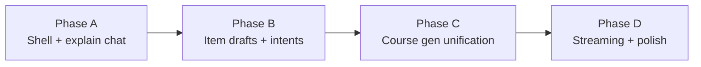

# Studio Author Assistant — Phase Plan Index

**Date:** 2026-08-12  
**Spec:** [`docs/superpowers/specs/2026-08-12-studio-author-assistant-design.md`](../specs/2026-08-12-studio-author-assistant-design.md)  
**Product context:** Course Creator Studio Phase 3 AI path ([`2026-08-05-course-creator-studio-design.md`](../specs/2026-08-05-course-creator-studio-design.md) § Phase 3)  
**Existing AI:** [`2026-08-10-studio-ai-item-add-edit-plan.md`](../specs/2026-08-10-studio-ai-item-add-edit-plan.md)

Consolidate Studio AI (Home start panel, ai-review page, outline modal, editor edit panel) into a **persistent Author Assistant** right sidebar, mirroring the learner Pipili companion.

## Plans

| Phase | Plan                                                                                               | Ships                                                       |
| ----- | -------------------------------------------------------------------------------------------------- | ----------------------------------------------------------- |
| **A** | [`2026-08-12-studio-author-assistant-phase-a.md`](./2026-08-12-studio-author-assistant-phase-a.md) | Shell, context bridge, suggestion chips, explain-only chat  |
| **B** | [`2026-08-12-studio-author-assistant-phase-b.md`](./2026-08-12-studio-author-assistant-phase-b.md) | Item draft cards, intents, remove AiEditPanel / AiAddDialog |
| **C** | [`2026-08-12-studio-author-assistant-phase-c.md`](./2026-08-12-studio-author-assistant-phase-c.md) | Course gen in sidebar, draft-then-commit, remove ai-review  |
| **D** | [`2026-08-12-studio-author-assistant-phase-d.md`](./2026-08-12-studio-author-assistant-phase-d.md) | Streaming, IDB history, next-steps, polish                  |

## Recommended order

```text
Phase A → Phase B → Phase C → Phase D
```

Phases are sequential: B needs A’s shell/providers; C needs B’s draft cards; D polishes C.

## Shared constraints (all phases)

- Creator mode only; Developer mode unchanged
- UI: `@open-edu/design-system` + `--oe-*` tokens; no hardcoded hex
- Copy: `studio.assistant.*` i18n keys; `pnpm lint:hardcoded-strings`
- Accessibility: axe-clean components; semantic sidebar
- Never expose API keys in the client
- Human-in-the-loop: drafts require Use/Accept before package writes (Phase C fixes course-gen exception)
- Feature flag: `OPEN_EDU_STUDIO_ASSISTANT` + `localStorage` `openedu.studio.assistant.enabled`
- Tests required (Vitest); conventional commits `feat(dev-server):` / `feat(studio):`
- One phase per PR; branch template `cursor/studio-author-assistant-phase-*-3021`

## Dependency graph



## Explicitly not in A–D

- Developer-mode AI
- Bundle Creator AI
- Full autonomous multi-file agent without human confirm
- Hosted Studio auth/storage (Phase 5 of product roadmap)
- Replacing the portable `skills/openedu-course-authoring/` skill
