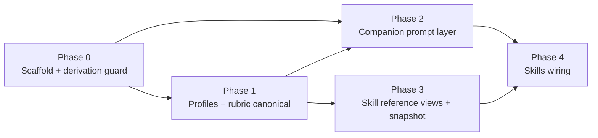

# Domain Guidance Consolidation — Implementation Plan

**Date:** 2026-09-01
**Decision record:** [`openedu-way/ADR-0009-unified-course-authoring-guidance.md`](../../../openedu-way/ADR-0009-unified-course-authoring-guidance.md)
**Related:** [`2026-07-25-openedu-course-authoring-skill-impl.md`](./2026-07-25-openedu-course-authoring-skill-impl.md), [`2026-08-12-studio-author-assistant-index.md`](./2026-08-12-studio-author-assistant-index.md), [`2026-08-15-community-widget-phase4-governance.md`](./2026-08-15-community-widget-phase4-governance.md)

Consolidate course-authoring domain knowledge behind `@open-edu/domain-guidance` per ADR-0009. The ADR owns the decision (derivation rule, versioning model, consumer sequencing); this plan owns the implementation detail.

## Ground rules (from the ADR)

1. **Derivation, never re-declaration.** `artifact-contract.json` is generated from `@open-edu/course-compiler` schemas; widget rules stay in `widget-catalog-data.json` enrichment. `domain-guidance` is canonical only for profiles and the quality rubric.
2. **No `widget-rules.json`.** Widget interpreter semantics are aligned with shared fixture tests, not a new data file.
3. **Per-block `schemaVersion`**, committed generated views, CI freshness checks.
4. **Sequence by live wiring:** companion prompt layer → skill references → companion skill resolution.

## Authoritative owners today (verified)

| Content              | Enforcing owner                                                               | Hand-maintained duplicates to eliminate                                                                                           |
| -------------------- | ----------------------------------------------------------------------------- | --------------------------------------------------------------------------------------------------------------------------------- |
| Course-spec schema   | `packages/course-compiler/src/parser/json-input.ts` (Zod)                     | `skills/.../references/artifact-contract.md`; `COURSE_SPEC_CONTRACT` in `apps/dev-server/src/studio/ai/prompts/coursePrompt.ts:3` |
| Widget catalog/rules | `packages/core/src/widget-catalog-data.json` (`generate:catalog`)             | Interpreter logic: `skills/.../scripts/widget-catalog.mjs` vs `buildPrompt.ts` guards + `curatedCatalog.ts`                       |
| Learner profiles     | none (skill-only: `references/profile-*.md` + `scripts/profiles.config.json`) | —                                                                                                                                 |
| Quality rubric       | none (skill `quality-report.mjs` vs Studio `qualityMap.ts`)                   | —                                                                                                                                 |

## Package shape

```
packages/domain-guidance/
├── package.json          # exports: "." (typed reader), "./data" (JSON subpaths for .mjs readers)
├── tsconfig.json
├── src/
│   ├── index.ts          # public typed accessors (profiles, rubric, artifact contract view)
│   ├── types.ts          # Zod schemas for profiles + quality-rubric blocks (source of truth)
│   ├── generate.ts       # generator: artifact-contract view, prompt snippets, skill reference views
│   └── data/
│       ├── artifact-contract.json  # GENERATED — do not hand-edit
│       ├── profiles.json           # canonical — absorbs scripts/profiles.config.json
│       └── quality-rubric.json     # canonical — dimensions, thresholds, messages
└── dist/                 # built ESM (TS consumers resolve via package exports; .mjs scripts read src/data directly)
```

Widget views render from `@open-edu/core/widget-catalog-data` (existing subpath export) — no widget data file here.

## Phases

### Phase 0 — Scaffold + derivation infrastructure

- Create `@open-edu/domain-guidance` package (workspace, exports `.` + `./data`).
- Generator: derive `artifact-contract.json` from `@open-edu/course-compiler` schema exports (`CourseModelSchema`, `parseCourseSpecJSON`). Requires course-compiler to export its input schema via `package.json` exports if not already public.
- The generator emits **two distinct outputs** for the artifact contract:
  - the **derived JSON view** — schema facts only (fields, types, required, enums) from the Zod schemas;
  - an authored **prompt view** that combines the derived facts with curated, model-facing phrasing (today's `RULES` prose — measurable-objectives wording, quiz-count rule). Rules enforced by course-compiler diagnostics derive from the compiler; purely stylistic model guidance stays authored and versioned in `domain-guidance`. The prompt view must never be a bare schema re-render — the curated prose is what makes the prompt good.
- **Sync guard test:** regenerate in-test and compare to the committed file; fail on diff.
- **Golden-file test** on the generated prompt snippet: changes to phrasing require an explicit, reviewed snapshot update — guarding model-facing quality, not just data sync.
- CI freshness: `pnpm --filter @open-edu/domain-guidance generate` must produce no diff (mirror `@open-edu/widgets generate:catalog` discipline).
- Acceptance: committed `artifact-contract.json` regenerates byte-identical from a course-compiler schema change; guard test fails when hand-edited; the prompt snippet renders curated prose over derived facts.

### Phase 1 — Profiles + quality rubric become canonical

- Extract profile Guidance/Output deltas from `references/profile-*.md` and machine knobs from `scripts/profiles.config.json` into `profiles.json` (Zod schema in `types.ts`, `schemaVersion: 1` carried over).
- Extract rubric dimensions/thresholds/messages from `quality-report.mjs` / `summarize-quality.mjs` and Studio `qualityMap.ts` into `quality-rubric.json` (dimension ids must match existing Studio quality ids: `objectives`, `assessment`, `duration`, `completeness`).
- Update skill scripts (`profiles.mjs`, `quality-report.mjs`) to read the package JSON in repo mode: the adapter gains a `guidanceData` path mirroring the proven `catalogData` pattern (`openedu-adapter.mjs:66` resolves a direct repo-relative path to `packages/core/src/widget-catalog-data.json` — `src/`, no build dependency; `guidanceData` resolves `packages/domain-guidance/src/data/*.json` the same way). Portable mode falls back to the bundled snapshot. The `./data` subpath export serves TS consumers only.
- Acceptance: `pnpm --filter @open-edu/domain-guidance test` covers both blocks; skill script tests pass reading the new source; portable mode still works from the snapshot.

### Phase 2 — Companion prompt layer migration (first wired consumer)

- Replace hardcoded `COURSE_SPEC_CONTRACT` (coursePrompt.ts) with the Phase 0 authored prompt view imported from `domain-guidance`.
- Source item add/edit prompt profile text and the **prompt-facing** rubric view from `domain-guidance` (`itemAddPrompts.ts`, `itemEditPrompts.ts`). Studio **UI-facing** quality strings stay in `qualityMap.ts` untouched until the i18n ticket lands — this phase must not entrench hardcoded English UI copy in the new canonical store.
- Keep `renderWidgetCatalogSection()` as-is (already renders live catalog data); extend `catalog-guard.test.ts` to assert the prompt snippet matches the derived artifact-contract view.
- **Shared widget-interpreter fixtures:** one fixture set (canonical ids, deprecated ids, legacy→replacement mappings) run through both `skills/.../scripts/widget-catalog.mjs` functions (`isCanonicalWidget`, `isDeprecatedWidget`, `resolveLegacyWidgetId`) and the TS guards (`isCatalogWidgetId`, `assertCatalogWidgetId`) — semantics must agree.
- Acceptance: no hand-maintained contract text in `apps/dev-server/src/studio/ai/prompts/`; fixture test proves interpreter parity; `pnpm --filter @open-edu/dev-server test` green.

### Phase 3 — External skill references become generated views

- Generator emits `references/artifact-contract.md`, `references/profile*.md`, `references/quality-rubric.md` views from the JSON; committed, CI-freshness-checked.
- Portable-mode snapshot: bundle guidance JSON + recorded data version into the skill; repo mode prefers repo data and reports the snapshot version in `quality-report.json` when versions differ.
- Acceptance: hand-editing a generated reference fails CI; portable mode quality report records guidance version.

### Phase 4 — Wire skill resolution (prerequisite for profile consumption)

Two gaps block live resolution today; **both** must close. Wiring the resolver alone is a no-op in real usage: nothing in the Studio populates `ctx.learner` (`StudioApp.tsx:234` renders the context bridge without the `learner` prop), so `resolveSkills.ts:15` always returns `[]` — the Studio is a teacher-authoring product with no live learner by definition.

- **4a — Learner source (the missing value).** `learner` in Studio context means the **target learner profile the author selects for the course being authored**, not a live learner. Add a target-profile selection to the Studio (options rendered from `domain-guidance` profiles), persist it with the course (course-brief/spec metadata), and pass it through the existing `learner` prop on `StudioContextBridge` (`StudioContextBridge.tsx:23` — the prop and `snapshot.learner` write at lines 63–64 already exist; only the caller omits them).
- **4b — Server wiring.** Pass `skills: createSkillResolver(...)` to `runAgentLoop` in `apps/dev-server/src/studio/ai/chat/handler.ts` (option exists at `agentLoop.ts:26`, omitted at the call site). Note: without 4a this changes nothing — the resolver still returns `[]`.
- **4c — Content.** `learner-adaptation` instructions render from `domain-guidance` profile data.
- Kind alignment: `learnerProfileSchema.kind` (`packages/companion/src/context.ts:22`) accepts `school | college | adult | family | neurotypical | autism`. The four domain-guidance profiles all map to enum values; `adult`/`family` have no profile content yet, so the selection UI offers only mapped kinds.
- Acceptance: with a target profile selected, live chat resolves `learner-adaptation` end-to-end (handler-level test, not agentLoop unit only); with no selection (the default), the resolver returns no skills — by design. Profile text changes propagate via regeneration only.

## Shared constraints (all phases)

- Tests required (Vitest); one phase per PR; conventional commits `feat(domain-guidance):` / `feat(dev-server):` / `feat(skill):`
- Zod schemas as source of truth; no cross-package imports except published `package.json` exports (course-compiler schema export added in Phase 0 follows the subpath-export pattern)
- Generated artifacts are committed; regeneration must be no-op in CI
- Model-facing guidance text stays English-canonical (not user-facing UI copy; i18n `t()` rules do not apply to prompt content, but do apply to any Studio UI strings)

## Dependency graph



## Explicitly not in scope

- Redesigning the `CompanionSkill` runtime mechanism (registry/resolver stay as-is)
- Runtime Markdown parsing anywhere in the companion
- Moving widget catalog data or its generation pipeline into `domain-guidance`
- Studio UI copy/i18n changes — including `qualityMap.ts`'s hardcoded English `detail` strings (separate i18n ticket, not this plan). Phase 2 moves only prompt-facing rubric text into `domain-guidance`; UI-facing strings stay in place until that ticket lands.
- The standalone open-edu-pipeline repo
